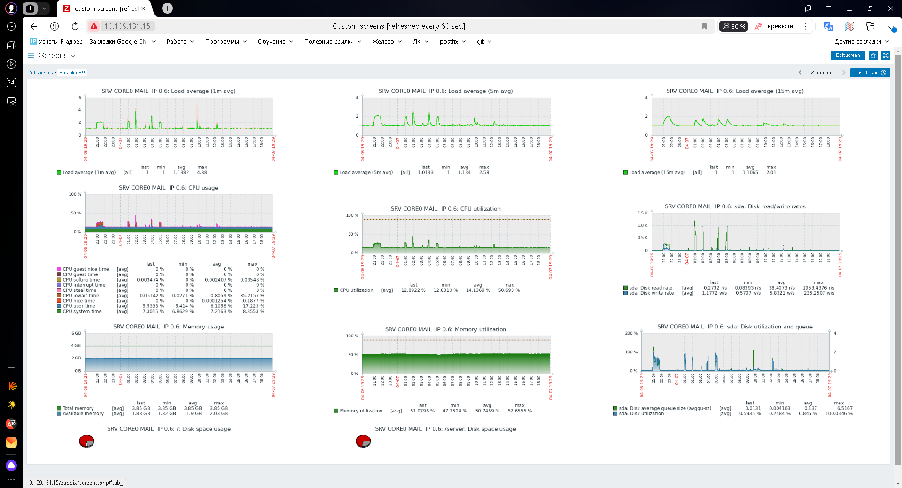

# Настройка мониторинга #

## Цель:
научиться настраивать дашборд
## Домашнее задание
Настроить дашборд с 4-мя графиками

память;
процессор;
диск;
сеть.

Настроить на одной из систем:
zabbix (использовать screen (комплексный экран);
prometheus - grafana.

## Описание выполнения домашнего задания.

Мониторинг настроен в системе ZABBIX

Результат представлен на скриншоте 